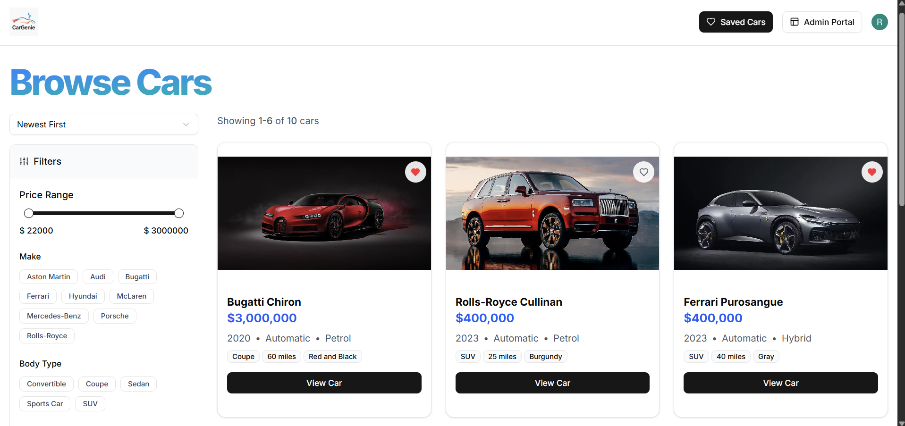
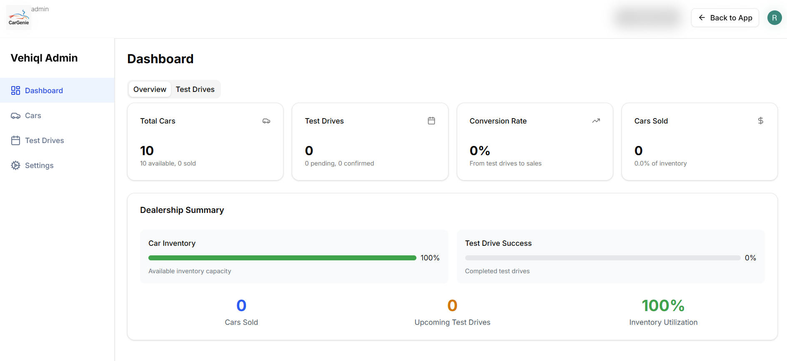

# CarGenie - AI-Powered Car Marketplace

CarGenie is a full-stack AI-powered car marketplace that enables users to explore, test drive, and purchase cars online. Built with cutting-edge technologies like Next.js, Supabase, Prisma, Tailwind CSS, ArcJet, and Shadcn UI, CarGenie provides a seamless experience for both users and administrators.

## Features

### 🚗 User Features

* Browse available cars with detailed specifications
* AI-powered car recommendations
* Book test drives for selected vehicles
* Secure user authentication and profile management
* Responsive and modern UI

### 🛠️ Admin Features

* Admin dashboard to manage car listings
* View and manage user profiles
* Manage test drive bookings
* Role-based access control for secure admin access

## Tech Stack

* **Frontend:** Next.js, Tailwind CSS, Shadcn UI
* **Backend:** Supabase, Prisma
* **Authentication & Security:** ArcJet, Supabase Auth
* **Database:** Supabase PostgreSQL

## Setup Instructions

1. **Clone the repository**

```bash
   git clone https://github.com/Ramendra777/Car-MarektPlace-App
   cd Car-MarektPlace-App
```

2. **Install dependencies**

```bash
   npm install
```

3. **Configure environment variables**

   * Create a `.env` file and add the required Supabase and ArcJet credentials.

4. **Run the development server**

```bash
   npm run dev
```

5. **Prisma Setup (if using local DB for development)**

```bash
   npx prisma generate
   npx prisma migrate dev --name init
```

## Screenshots



